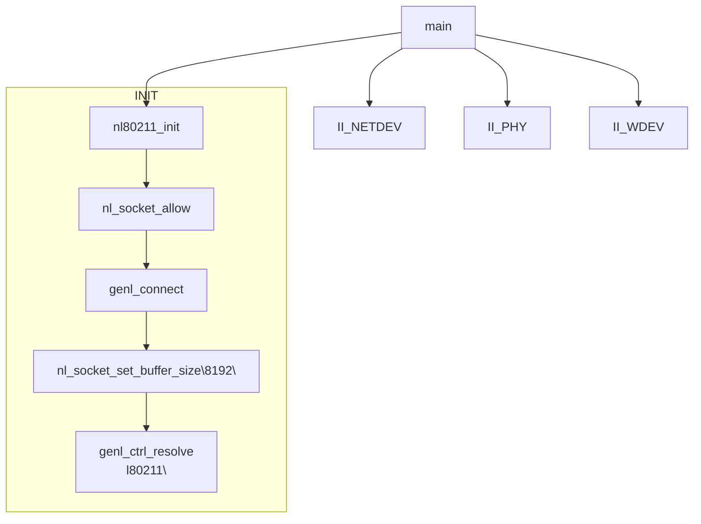

# Procedure Analysis

```mermaid
graph TD;

l0_0[main]-->l1_0[nl80211_init]

subgraph INIT
l1_0-->l2_0[nl_socket_allow]
l2_0-->l2_1[genl_connect]
l2_1-->l2_2[nl_socket_set_buffer_size\8192\]
l2_2-->l2_3[genl_ctrl_resolve\nl80211\]
end

l0_0-->l1_1[II_NETDEV]
l0_0-->l1_2[II_PHY]
l0_0-->l1_3[II_WDEV]


```

